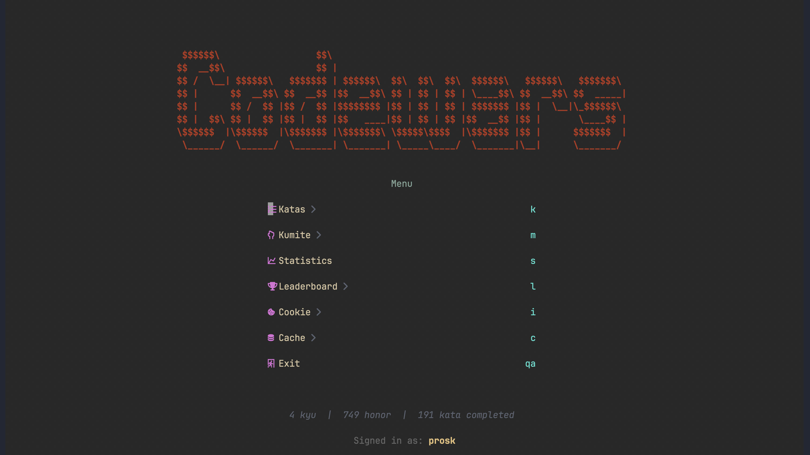

# codewars.nvim

Solve [Codewars](https://www.codewars.com) katas from within Neovim.



## What it does

- **Train** — open any kata by title, slug or URL, write your solution with
  the description and test cases beside it, then `test` / `attempt` / `submit`.
- **Find work** — browse and filter all kata, see your completed ones, or let
  Codewars' trainer pick with Choose Today's Focus.
- **Community solutions** — after solving, browse other people's solutions
  with their Best Practices / Clever counts and rendered comment threads, and
  vote from the popup.
- **Leaderboards** — top-500 boards for Overall, Completed Kata, Authored Kata
  & Translations, and Ranks.
- **Freestyle Sparring** — browse kumite, fork one into an editable copy, run
  it against its fixture, and save or publish it back.
- **Author kata** — turn a kumite into a kata and finish it without leaving
  Neovim: solution, initial solution, tests, example tests, description,
  metadata, language and runtime, then publish.

- **Your own starter code** — per-language templates so every kata opens with
  the imports and scaffolding you actually use, wrapped around the signature
  Codewars grades. `:CW template off` turns them off again, buffer and all.
  See [CONFIGS.md](CONFIGS.md#templates).

## Requirements

- Neovim >= 0.9.0
- [plenary.nvim](https://github.com/nvim-lua/plenary.nvim) — HTTP requests, file operations
- [nui.nvim](https://github.com/MunifTanjim/nui.nvim) — UI components
- [telescope.nvim](https://github.com/nvim-telescope/telescope.nvim) — kata picker, language picker
- [nvim-treesitter](https://github.com/nvim-treesitter/nvim-treesitter) with `markdown` parser — description rendering (optional)
- [markdown.nvim](https://github.com/tadmccorkle/markdown.nvim) — enhanced markdown rendering (optional)

## Installation

### lazy.nvim

```lua
{
  "prosk-sudo/codewars.nvim",
  version = "*",  -- pin to tagged releases; remove to track main
  lazy = false,
  dependencies = {
    "nvim-lua/plenary.nvim",
    "MunifTanjim/nui.nvim",
    "nvim-telescope/telescope.nvim",    -- kata picker / language picker
    -- optional
    "tadmccorkle/markdown.nvim",        -- markdown rendering in description
  },
  opts = {},
}
```

`version`, `dir` and the trade-offs between them are covered in
[CONFIGS.md](CONFIGS.md#plugin-manager-options-lazynvim).

## Authentication

### Getting Your Cookies

1. Log in to [codewars.com](https://www.codewars.com) in your browser
2. Open **Developer Tools** (F12) → **Application** tab → **Cookies**
3. Find these two cookies for `www.codewars.com`:
   - `CSRF-TOKEN`
   - `_session_id`
4. Run `:CW cookie` in Neovim and paste them in this format:

```
CSRF-TOKEN=your_csrf_value; _session_id=your_session_value
```

Your cookies are stored locally at `~/.cache/nvim/codewars/cookie`.

## Usage

### Standalone Mode

Launch Neovim with the plugin argument to get a dashboard:

```bash
nvim codewars.nvim
```

### Available Commands

See [COMMANDS.md](COMMANDS.md) for the full list, or run `:CW help` inside Neovim.

### Solving a kata

```
:CW cookie               " paste your browser cookies (one-time setup)
:CW train multiply python
```

This opens the `8 kyu Multiply` kata with the description on the left, the code
editor on the right, and the test cases below it. Write your solution, then
`:CW test` → `:CW attempt` → `:CW submit`.

To find something to solve, `:CW focus` lets Codewars' trainer pick for you,
`:CW list` browses everything with filters, and `:CW completed` shows what
you've already finished.

### Writing your own

Kata are authored from kumite. Browse or start one with `:CW kumite`, fork it,
run it against its fixture with `:CW test`, then save it and use
`:CW kumite convert` to turn it into a kata draft.

`:CW kata open <id|url>` opens that draft in the editor. Its five text fields —
Complete Solution, Initial Solution, Test Cases, Example Test Cases and
Description — each get their own buffer, switched with `g1`…`g5`, so edits in a
hidden pane are never lost. A read-only side panel keeps the metadata, pane list
and keys in view while `:CW kata meta`, `validate`, `save` and `publish` finish
the kata off.

If Codewars rejects a save, publish, or convert because the name is taken, the
plugin offers a rename and retries.

### Health check

```
:CW doctor
```

Reports Neovim version, dependencies, auth state, and cache status. It also
runs the HTML parsers against committed fixtures — Codewars has no public API
for most of this data, so that check turns a silent scraping break into a
visible diagnostic.

## Configuration

All settings are optional. See [CONFIGS.md](CONFIGS.md) for the full reference.

```lua
require("codewars").setup({})
```

## Current Issues

- Long test output lines (e.g. random test inputs with large data structures) may overflow the result popup. Neovim's `wrap` option is enabled but may not fully contain all content within NUI Layout popups.
- Some language icons in the picker may display as boxes or incorrect characters depending on your Nerd Font version and variant. Nerd Font v3 reorganized many codepoints, and not all patched fonts include every icon set (Devicons, Material Design, Seti-UI, etc.).

## Acknowledgements

This plugin was heavily inspired by [leetcode.nvim](https://github.com/kawre/leetcode.nvim) by [@kawre](https://github.com/kawre)!

Built and maintained with the help of [Claude Code](https://claude.ai/claude-code).

## License

[MIT](LICENSE)
